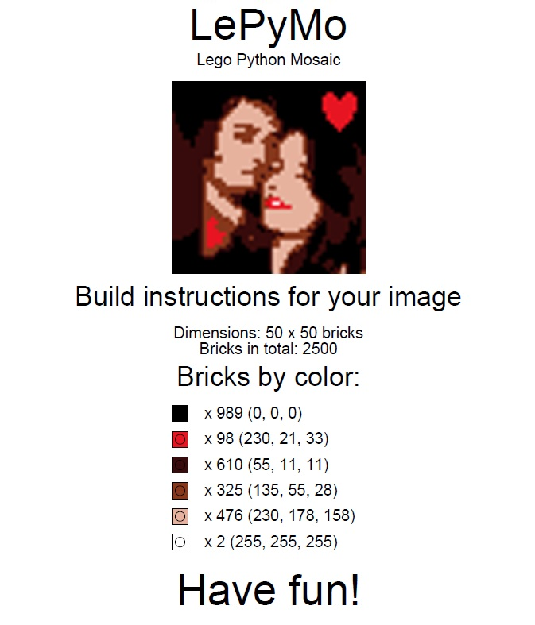
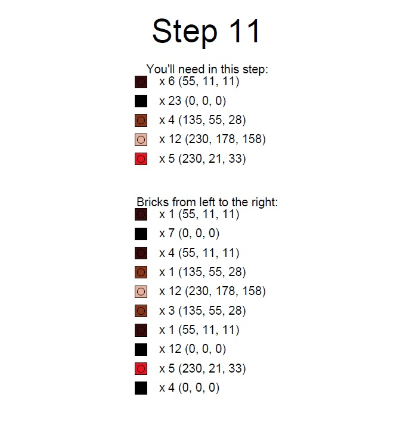

# lego+python=mosaic
 Program LePyMo was developed to simplify creating mosaic from images using Lego-like bricks.

## The idea
 I was thinking about a birthday gift for my fiancée, and I came with this concept - to create a mosaic using our pictures and Lego bricks.

## How does it work ?
 Firstly this program transforms selected image to a palette of certain colors. 
 After that LePyMo creates a PDF containing building instructions for this new image.

## How to run LePyMo ?
 There are 3 ways to run this program:

### Using LePyMo.exe created by myself
 This is the easiest one - just download .exe from [here](https://kjuraszek.pl/lego-python-mosaic/).

### Running script
 `Warning!` This program was tested with python 3.7 (I had some issues to build .exe using 3.8 and 3.9).
 
 It's a good idea to create and activate a virtual environment first using e.g. `virtualnenv`.

 Clone this repository to your hard drive with:
 #### `git clone https://github.com/kjuraszek/lego-python-mosaic`

 Install packages in project directory using e.g. `pip` and `requirements.txt` file.
 #### `pip3 install -r requirements.txt`

 Run program:
 #### `python3 lepymo.py`

### Creating .exe on your own
 This is a similar way to the previous one. Instead of running .py script - you build an executable file (.exe).
 You can use pyinstaller:
 #### `pyinstaller --onefile --windowed --icon=app.ico --version-file=version.txt lepymo.py`

## How to use it ?

First you have to prepare your desired image - its dimensions (in pixels) must be equal to 
the size (in bricks) of mosaic you are planning to create. E.g. when your plate is 50 by 50 
bricks, your image dimensions must be 50px by 50px. 

The next step is to add colors to your palette. Keep in mind that some colors aren't used in brick production - you are limited to less 
than 300 colors. At this stage it is better to keep Don't generate PDF option turned on to test 
selected color palette. The process of creating desired image can take even up to a few minutes - 
it depends on amount of colors in your palette and dimensions of image. 

When you are satisfied with output image you can turn off Don't generate PDF option. This process also can take up to a
few minutes - it depends on amount of colors in your palette and dimensions of image. The PDF 
consists of total bricks amount of each color and building instructions divided in steps - each 
step is one row.

Have fun!

 ## Examples
 ### Build instructions:
 
 
 ### Final effect:

 ### Mosaic timelapse:
(click to watch it on Youtube)

